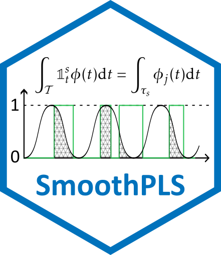

# SmoothPLS 

[](https://github.com/FrancoisBassac/SmoothPLS/actions)


## 🎯 Overview

**SmoothPLS** is an R package designed for **Hybrid Functional Data Analysis**. It implements a novel approach to Functional Partial Least Squares (FPLS) by integrating categorical functional predictors through the concept of **"Active Area Integration"**.

This work was developed as part of a PhD project at **[DECATHLON](https://www.decathlon.fr/)** in collaboration with **[INRIA](https://www.inria.fr/)**.

### Key Features
- **Smooth PLS**: Integration of categorical states as indicator functions for smoother regression curves.
- **Hybrid Data**: Seamlessly handle both Scalar Functional Data (SFD) and Categorical Functional Data (CFD).
- **Interpretability**: Provides regression curves $\beta$ even for discrete state changes.
- **Comparison Suite**: Built-in functions to compare results with Naive (discretized) PLS and Standard Functional PLS.

---

## 🔬 Mathematical Intuition

The core innovation lies in treating categorical predictors not as simple dummy variables, but as functional indicator functions $\mathbb{1}^k_t$. The model computes components by integrating over the specific intervals where a state is present:

$$\Lambda_{i,j} = \int_{T} \mathbb{1}_{\{X_i(t) = s_j\}} \phi(t) dt$$

This ensures that the smoothing process respects the physical reality of state transitions while maintaining the continuous framework of Functional PLS.

---

## Installation
Currently in development. Install the latest stable version using:
```R
# install.packages("devtools")
devtools::install_github("FrancoisBassac/SmoothPLS")
```

---

## 🚀 Quick Start Example

Based on the single-state CFD vignette, here is how to fit and compare models:

```R
library(SmoothPLS)

# 1. Generate Synthetic Data
df_x <- generate_X_df(nind = 100, curve_type = 'cat')
Y_df <- generate_Y_df(df_x, curve_type = 'cat', 
                      beta_real_func_or_list = beta_1_real_func)

# 2. Fit Smooth PLS Model
basis <- create_bspline_basis(start = 0, end = 100, nbasis = 10)
spls_model <- smoothPLS(df_list = df_x, Y = Y_df$Y_noised, 
                        basis_obj = basis, curve_type_obj = 'cat')

# 3. Predict and Visualize
preds <- smoothPLS_predict(df_x, spls_model$reg_obj, curve_type = 'cat')
plot(spls_model$reg_obj$CatFD_1_state_1, main="SmoothPLS Regression Curve")
```

---

## 🔗 Some Links

### 👟 Industrial Partners & Applications
* **[Decathlon](https://www.decathlon.fr/)** – Main industrial partner.
* **[Decathlon SportsLab](https://www.decathlon.com/pages/sportslab)** – The research and development center.
* **Kiprun Pacer** – The training application using advanced running data:
    * [Official Website](https://kiprun.com/pacer/)
    * [App Store / Play Store](https://kiprun.com/pacer/download)

### 🔬 Research Institutions
* **[Inria](https://www.inria.fr/)** – National Institute for Research in Digital Science and Technology.
* **[Inria Dataverse](https://data.inria.fr/)** – The research team specialized in stochastic modeling and data analysis.
* **[Modal Team](https://www.inria.fr/fr/equipes/modal)**
